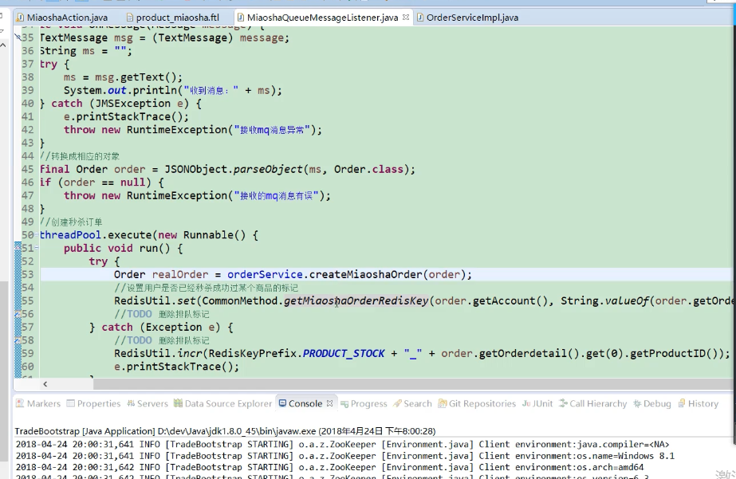

## 参数调优
+ Nginx 并发数
    - worker-connections
+ Tomcat 并发数和请求超时时间
+ Redis 连接池
+ 数据库连接池  Too many connections
+ Linux 系统句柄数 Too many open files

## 秒杀系统设计
### 秒杀结果标识
- 使用 HashMap 保存秒杀结束标识，提高查询效率，内存比Redis查询速度快
### 异步队列
- 接收到请求，将请求数据发送到MQ消息队列，MQ处理秒杀业务
- 并给前端返回正在秒杀状态，秒杀成功把Redis中的秒杀状态改变
- 前端接收到正在秒杀状态，查询秒杀结果接口
   - 查询Redis状态，成功返回秒杀成功
   - 查询【数据库】状态，库存为0返回库存为0
   - 查询Redis状态，正在秒杀，轮训查询秒杀接口

 ## 安全优化
 + 秒杀接口地址隐藏
 + 加验证码
 + 接口限流防刷
 
 ## 水平扩展
 - 分布式session  
      - tomcat-redis-session-manager
- Redis 高可用集群
- 微服务化
 

